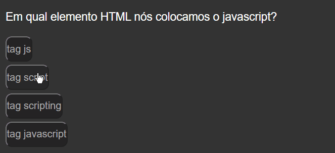

# README

<h2 align="center">Quiz</h2>

Tabela de conteúdos

----------------
<p align="center">
    <a href="#sobre">Sobre</a>
    |
    <a href="#tecnologias">Tecnologias</a>
    |
    <a href="#autor">Autor</a>
    |
    <a href="#rodando_front">Rodando o Front End</a>
    |
    <a href="#prereq">Pré-requisitos</a>
</p>

 ### Features

 - [x] Iteração dinamica de botões
 - [x] Troca de questões por clique
 - [x] Verificação de acertos
 - [x] Soma dos pontos obtivos
 - [x] Finalização do projeto
 
------------------------------
<h4 align="center">Exemplo do projeto rodando:</h4>
<br>

<h1 align="center"> 
 
</h1>

### 📖 Sobre
O que é um quiz?
     Quiz é o nome de um jogo de questionários que tem como objetivo fazer uma avaliação dos conhecimentos sobre determinado assunto.
    Neste tipo de jogo podem participar tanto grupo de muitas pessoas, como participantes individuais, que devem acertar a maior quantidade de respostas para ganhar.
    Em um quiz, por norma, os concorrentes devem responder as perguntas apenas com um termo afirmativo ou negativo, como por exemplo “certo ou “errado, “sim” ou “não”, e etc.

Como foi feito? 
     O quiz foi feito a base de Java Script puro, o seu Html e Css foram feitos pela B7Web, pois este projeto é a base de um desafio onde o desafio era fazer todo script do mesmo, mesmo fazendo apenas o script o projeto deu bastante trabalho, pois exige uma iteração de varias perguntas e modificações em seu index, por isso foi encontrado vários problemas e até precisou ser refatorado por completo por conta de um bug.
    
-------
### ✋ Pré-requisitos

Antes de começar, você vai precisar ter instalado em sua máquina apenas o [VsCode] (https://code.visualstudio.com/)

### 🎲 Rodando o Front End

```bash 
#Abra seu terminal do VSCode usando ctrl + "

# Clone o repositório
git clone <https://github.com/arielrigo/quiz-javascript.git>

#Baixe a extensão "Live server clicando no canto superior esquerdo"

#No diretorio va no HTML, clique com o botão direito e abra com Live Server
```
### 🛠 Tecnologias
 As seguintes ferramentas foram usadas na construção do projeto:

 - [Javascript](https://www.javascript.com)

----------------

### 👦 Autores
Javascript by: Ariel Rigo [See my Linkedin](https://www.linkedin.com/in/ariel-rigo-588682228/)

Html & Css by: Bonieky Lacerda [Youtube Channel](https://www.youtube.com/c/BoniekyLacerdaLeal)


